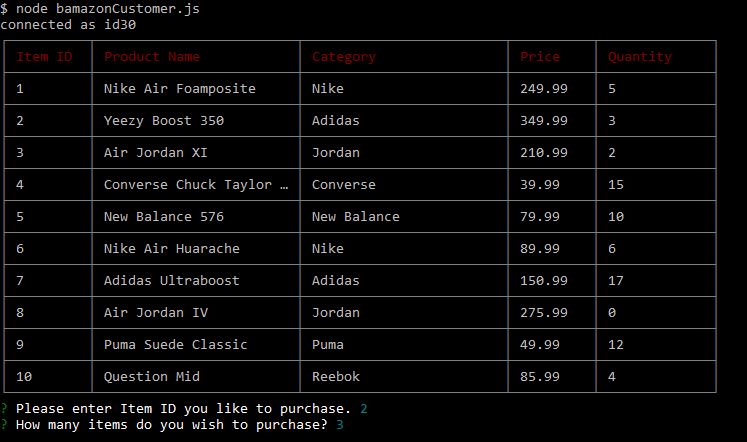

Bamazon Shoes
In this activity, I was required to create an Amazon-esque storefront using MySQL and node.js. The customer is asked to select which item (Shoes) they want to order by the id number, then how many of that item they want. It then gives them the total amount of their order, and deducts the number of items in inventory. 
